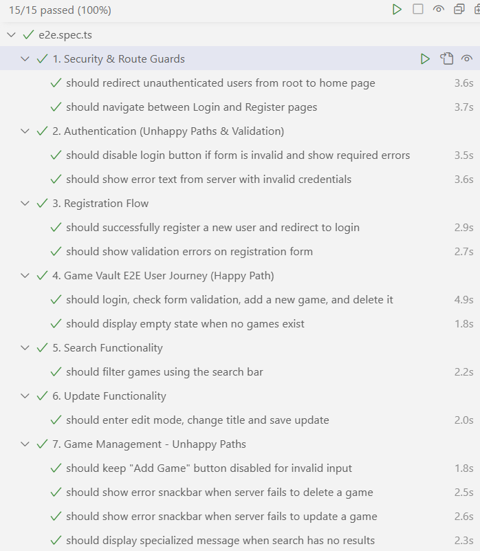
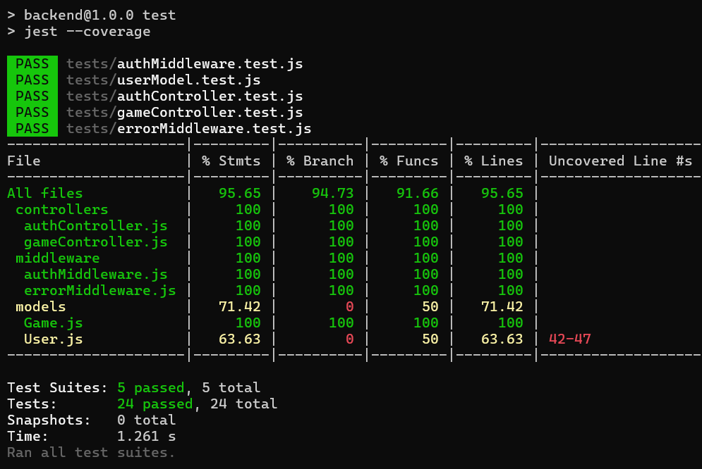

# Video Game Inventory Management System
[](https://github.com/DDaniel001/WebTechnologies2/actions/workflows/playwright.yml)

A modern inventory management application built as a final project for the Web Technologies 2 course. The system leverages the MEAN stack (MongoDB, Express, Angular, Node.js) to provide a scalable solution.

## Backend Features (REST API)

The backend is a production-ready REST API featuring:

* **User Authentication (JWT):** Secure registration and login using JSON Web Tokens.
* **Password Security:** Automatic `bcryptjs`-based encryption at the Model level before storage.
* **Route Protection:** Custom `protect` middleware to verify tokens before granting access to sensitive data.
* **Security & Rate Limiting:** Built-in protection against brute-force attacks with global and auth-specific request limits.
* **Global Error Handling:** Unified error format using a custom `asyncHandler` structure to maintain clean, try-catch-free controller logic.
* **Full CRUD Operations:** Comprehensive game management (Create, Read, Update, Delete) mapped to specific users.

---

## Automated Testing Architecture

### 1. End-to-End (E2E) Testing (Playwright)



The frontend UI is validated using **Playwright**, simulating real user behavior and critical business flows.
* **Page Object Model (POM):** The test suite is structured using the POM design pattern. HTML locators and page-specific actions are encapsulated in classes (e.g., `login.page.ts`, `home.page.ts`), ensuring high maintainability.
* **API Mocking & Network Interception:** Backend dependencies are isolated using Playwright's `page.route()`. This allows testing frontend logic (e.g., empty states, server errors, and data rendering) independently from the live database.
* **UI State Validation:** Tests strictly verify complex UI states, including `disabled` button logic for invalid forms and the accuracy of Angular Material validation messages.

### 2. Backend Unit & Integration Testing (Jest)



The Node.js REST API includes a comprehensive test suite to guarantee business logic integrity and security.
* **Isolated Testing (Mocking):** Using `jest.mock()`, the database layer (Mongoose models) and cryptographic functions (bcrypt) are mocked, allowing tests to run at lightning speed in total isolation.
* **AAA Pattern:** Every test case strictly follows the **Arrange, Act, Assert** structure for maximum clarity.
* **Happy Path & Negative Testing:** Beyond the "Happy Path," the suite covers edge cases and invalid inputs (unhappy paths) to ensure correct error messages and HTTP status codes are returned.

### 3. CI/CD Pipeline (GitHub Actions)
The project features a fully automated Continuous Integration (CI) workflow built with **GitHub Actions**.
* On every **push to the main branch**, a cloud-based Linux environment spins up a fresh MongoDB instance, installs Node.js v20, and initializes both backend and frontend servers.
* The workflow utilizes **TCP port monitoring** to wait for server readiness before triggering Playwright tests in **headless browsers**, ensuring stable and reliable deployment checks.

---

## Tech Stack

### Backend
* **Node.js & Express.js**
* **MongoDB & Mongoose**: Document-oriented database and ODM.
* **jsonwebtoken & bcryptjs**: For authentication and password hashing.
* **express-rate-limit & express-async-handler**: Security and clean error handling.

### Frontend
* **Angular 21**
* **Angular Material**: Professional UI component library.

### Testing Tools
* **Jest**: Backend Unit & Integration testing.
* **Playwright**: Frontend E2E Automation.

---

## Installation & Setup

### 1. Prerequisites
- Node.js (LTS version)
- MongoDB Community Server
- Postman (optional, for manual API testing)

### 2. Environment Variables (.env)
Create a `.env` file in the `backend` folder:

```env
PORT=3000
MONGO_URI=mongodb://localhost:27017/gamer_inventory
JWT_SECRET=your_super_secret_key_here
```

### Starting Backend
1. `cd backend`
2. `npm install`
3. `npm run dev`

### Starting Frontend
1. `cd frontend`
2. `npm install`
3. `ng serve`
4. Access the app at `http://localhost:4200`

---

| Method | Endpoint | Description | Protection |
| :--- | :--- | :--- | :--- |
| **POST** | `/api/auth/register` | Create a new user account | Rate Limited |
| **POST** | `/api/auth/login` | Authenticate and receive a JWT Token | Rate Limited |
| **GET** | `/api/games` | List all video games | Public |
| **POST** | `/api/games` | Add a new game to the inventory | **JWT Token** |
| **GET** | `/api/games/:id` | Get details of a specific game | **JWT Token** |
| **PUT** | `/api/games/:id` | Update an existing game's information | **JWT Token** |
| **DELETE** | `/api/games/:id` | Remove a game from the system | **JWT Token** |